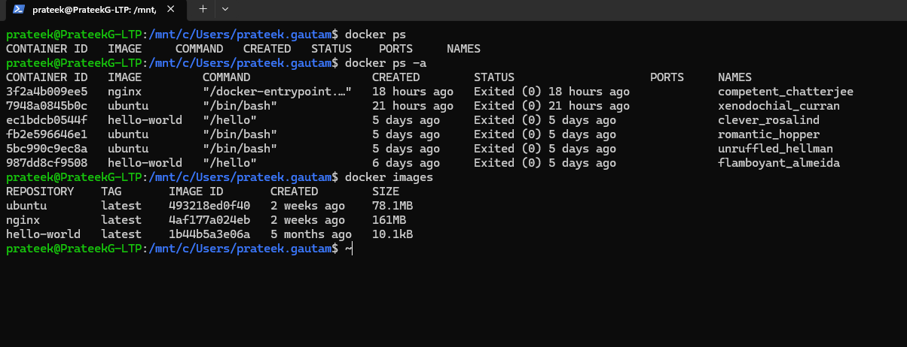

# Expdriment 1
## compare vm and container

Object: ....


```bash
docker ps
docker images
```

we user `docker ps` for getting list of running containers

- list
- list2


* sdf
* sdfsfs


1. sdfsdf last
1. sdfgs
1. sfvs

> sdfsgdefinition in blockquote

| first | second |
|:--- | :---:|
| first 23 | second |
| firstvs   | second |
| first | sdf second |
| first | second ssdf|

this is inline eqn $a=10$ $E=mc^2$

$$ \overrightarrow{F}=m\hat{a} $$

[title that is shown](url or link)


